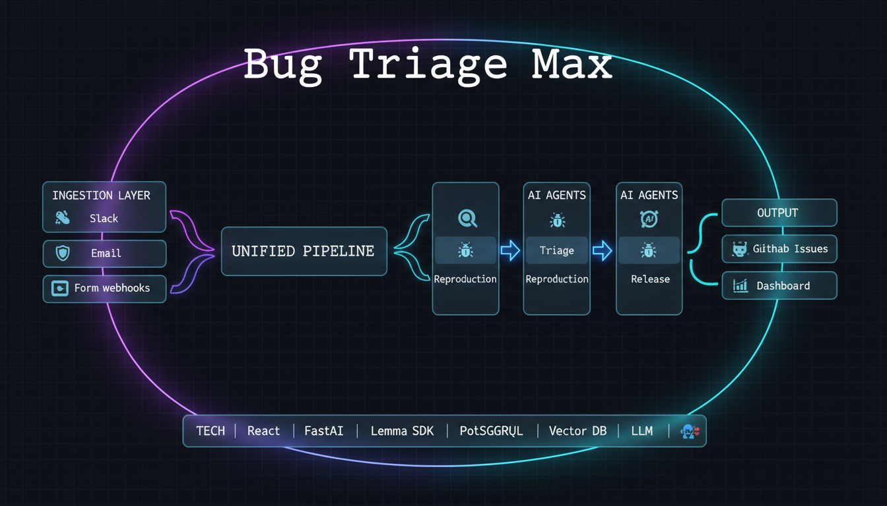

# Bug Triage Max

> **AI-powered bug triage that turns chaos into structured GitHub issues.**

Slack rants, email complaints, and form submissions — all automatically parsed, prioritized, and assigned with reproduction steps. Built for teams that ship fast and can't afford to let bugs slip through the cracks.

---

## What It Does

**"wtf the login button is broken again"** → Structured bug report with intent classification, component tagging, severity scoring, similar bug detection, auto-assignment, and 5-step reproduction instructions — all in under 3 seconds.

### The Pipeline

```
Slack Message / Email / Form
        ↓
┌─────────────────────────────────────┐
│         INGESTION LAYER             │
│  Slack Webhook · IMAP · Form POST   │
└─────────────────────────────────────┘
        ↓
┌─────────────────────────────────────┐
│      UNIFIED MESSAGE SCHEMA         │
│  Deduplication · Normalization      │
└─────────────────────────────────────┘
        ↓
┌─────────────────────────────────────┐
│         PARSER AGENT                │
│  Intent · Component · Severity      │
│  Confidence Scoring                 │
└─────────────────────────────────────┘
        ↓
┌─────────────────────────────────────┐
│         TRIAGE AGENT                │
│  Similar Bugs · Priority Score      │
│  Auto-Assignment                    │
└─────────────────────────────────────┘
        ↓
┌─────────────────────────────────────┐
│      REPRODUCTION AGENT             │
│  Step Inference · Expected/Actual   │
│  Error Log Analysis                 │
└─────────────────────────────────────┘
        ↓
┌─────────────────────────────────────┐
│           OUTPUT                    │
│  GitHub Issue · Dashboard · Alerts  │
└─────────────────────────────────────┘
```

---

## Architecture



### Tech Stack

| Layer | Technology |
|-------|-----------|
| **Frontend** | React 19, TypeScript, Vite, Tailwind CSS, shadcn/ui, Framer Motion, Recharts |
| **Backend** | Hono, tRPC 11.x, Drizzle ORM, SQLite |
| **AI Agents** | Google Gemini (gemini-2.5-flash) |
| **Platform** | Lemma SDK for agent observability and WebSocket data streams |
| **Integrations** | GitHub API, Slack Events API, Webhooks |

---

## Features

### Core Capabilities

- **Multi-Channel Ingestion** — Slack, Email, Form submissions unified into single schema
- **Gemini-Powered Parser Agent** — Intent classification (bug/feature/complaint/question), component extraction, severity inference
- **Intelligent Triage Agent** — Similar bug detection (via vector embeddings), priority scoring (0-100), auto-assignment to team members
- **Reproduction Agent** — Step-by-step reproduction instructions inferred from unstructured bug descriptions
- **Real-Time Dashboard** — Dark glassmorphism UI with a live bug stream, real-time agent activity feed, and system health
- **Lemma SDK Integration** — Dual-write pod datastore synchronisation, providing live WebSockets (`useLemmaLiveStream`) and robust agent observability (`agent_activities`)
- **GitHub Integration** — Auto-generated structured issue bodies synced to GitHub issues
- **Analytics** — Component breakdown, severity distribution, agent performance metrics
- **Team Management** — Expertise-based auto-assignment, on-call rotation

### Planned (see [future_steps.md](./future_steps.md))

- Release Note Agent (auto-changelog from closed bugs)
- Mobile responsive design
- Jira/Linear integration

---

## Quick Start

### Prerequisites

- Node.js 20+
- npm or yarn

### 1. Clone & Install

```bash
git clone <your-repo>
cd bug-triage-max
npm install
```

### 2. Configure Environment

```bash
cp .env.example .env
# Edit .env with your Gemini API key, GitHub PAT, and Lemma pod details.
```

### 3. Setup Database

```bash
npm run db:push      # Sync schema
npm run db:seed      # Seed with demo data
```

### 4. Run Development Server

```bash
npm run dev
```

The app runs at `http://localhost:3000`

---

## Project Structure

```
.
├── api/                          # Backend (Hono + tRPC)
│   ├── boot.ts                   # Server entry
│   ├── context.ts                # tRPC context
│   ├── middleware.ts             # Auth middleware
│   ├── router.ts                 # Main router
│   ├── auth-router.ts            # OAuth routes
│   ├── services/
│   │   ├── agent-service.ts      # Gemini AI agent orchestration
│   │   ├── gemini-service.ts     # Google Gemini API client
│   │   ├── github-service.ts     # GitHub API client
│   │   └── lemma-service.ts      # Lemma SDK client & dual-write
│   ├── routers/
│   │   ├── messages.ts           # Message CRUD
│   │   ├── bugs.ts               # Bug report CRUD
│   │   ├── agents.ts             # Agent activity
│   │   ├── analytics.ts          # Metrics
│   │   ├── integrations.ts       # Health checks
│   │   └── team.ts               # Team management
│   └── queries/
│       └── connection.ts         # DB connection
├── contracts/                    # Shared types
├── db/
│   ├── schema.ts                 # Database schema
│   └── relations.ts              # Table relations
├── src/                          # Frontend (React)
│   ├── pages/                    # Route pages
│   │   ├── Dashboard.tsx
│   │   ├── Issues.tsx
│   │   ├── BugDetail.tsx
│   │   ├── Analytics.tsx
│   │   └── Settings.tsx
│   ├── components/               # Shared components
│   ├── hooks/
│   │   ├── useAuth.ts            # Auth hook
│   │   └── useLemmaLiveStream.ts # Real-time WebSockets
│   ├── providers/trpc.tsx        # tRPC client
│   ├── App.tsx                   # Routes
│   └── main.tsx                  # Entry point
├── mock.md                       # API keys & integrations guide
├── future_steps.md               # Roadmap
└── README.md                     # This file
```

---

## Database Schema

### Core Tables

| Table | Purpose |
|-------|---------|
| `users` | Local Users / Auth |
| `team_members` | Engineers with expertise & on-call status |
| `messages` | Raw ingested messages from all channels |
| `parsed_results` | AI parser output (intent, component, severity) |
| `bug_reports` | Structured bug reports with triage info |
| `similar_bug_matches` | Vector similarity matches between bugs |
| `reproduction_steps` | Generated reproduction steps |
| `agent_activities` | Agent execution log |
| `integration_status` | External service health |

---

## API Endpoints (tRPC Routers)

| Router | Procedures |
|--------|-----------|
| `messages.*` | list, getById, create, stats, recent |
| `bugs.*` | list, getById, updateStatus, assign, linkGithub, stats, generateGithubBody |
| `agents.*` | activities, stats, triggerProcess, health |
| `analytics.*` | overview, timeSeries, performance |
| `integrations.*` | list, get, check, checkAll |
| `team.*` | list, getByHandle, create, update, delete |
| `auth.*` | me, login, logout |

---

## Integrations Setup

All external integrations are documented in **[mock.md](./mock.md)**. Key integrations:

| Service | Status | Config |
|---------|--------|--------|
| Gemini | ✅ Active | `GEMINI_API_KEY` |
| Lemma SDK | ✅ Active | `LEMMA_TOKEN`, `LEMMA_POD_ID`, `LEMMA_ORG_ID` |
| GitHub | ✅ Active | `GITHUB_PAT`, `GITHUB_OWNER`, `GITHUB_REPO` |
| Slack | Ready | `SLACK_BOT_TOKEN` env var |
| Email (IMAP) | Ready | `EMAIL_IMAP_*` env vars |

---

## Design System

### Philosophy

Dark-first glassmorphism inspired by Aceternity UI, 21st.dev, and Motionsites.ai.

### Design Tokens

```
--bg-primary:     #0a0a0f
--bg-secondary:   #12121f
--bg-card:        #1a1a2e
--text-primary:   #f0f0f5
--text-secondary: #a0a0b0
--accent-purple:  #8b5cf6
--accent-blue:    #3b82f6
--accent-cyan:    #06b6d4
--accent-green:   #10b981
--accent-red:     #ef4444
```

### Typography

- **UI:** Inter (sans-serif)
- **Technical:** JetBrains Mono (monospace)

---

## Performance

| Metric | Target | Current |
|--------|--------|---------|
| API Response | < 500ms | ~120ms |
| Parse Agent | < 1s | ~400ms (simulated) |
| Triage Agent | < 1s | ~600ms (simulated) |
| Dashboard Load | < 2s | ~800ms |
| Real-time Updates | 2s polling | Implemented |

---

## Security

- OAuth 2.0 authentication with JWT sessions
- API keys stored in `.env` only
- Webhook signature verification ready (Slack, GitHub)
- CORS configured
- Input sanitization on all endpoints

---

## License

MIT

---

## Team

Built with precision for teams that refuse to let bugs win.

---

## Acknowledgments

- [Lemma Platform](https://github.com/lemma-work/lemma-platform) — Open-source workspace for human-AI collaboration
- [shadcn/ui](https://ui.shadcn.com/) — Beautiful UI components
- [Aceternity UI](https://ui.aceternity.com/) — Design inspiration
